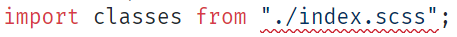

<p align="center">
  
</p>
<h3 align="center">No More Type Extension Error</h3>

&nbsp;

<p align="center">
  
  
</p>

&nbsp;

# common-dts 

Collection of reusable `.d.ts` files commonly used on your projects. So you don't need to Google it again.


## Installation

###### NPM

```bash
npm i -D common-dts
```

###### PNPM

```bash
pnpm add -D common-dts
```

###### Yarn

```bash
yarn add -D common-dts
```


## Usage

### A. Globally

The entire project will affected when using this method. So, you don't need to importing the type again.

> **Don't want to affect the entire project?** Use [Locally](#b-locally) method for individual file configuration.

###### Format

Put this code on any `.d.ts` file on your project. Or you can create a new one if it doesn't exist.

```ts
declare global {
  import "common-dts/types/<file-name>";
}
```
See [Supported Extensions](#supported-extensions) for the list of available `<file-name>`.

###### Example

```ts
declare global {
  import "common-dts/types/module.css";
  import "common-dts/types/module.scss";
  import "common-dts/types/react/svg";
}
```

### B. Locally

Only file with the imported type will affected when using this method.

###### Format

```ts
import "common-dts/types/<file-name>";
```
See [Supported Extensions](#supported-extensions) for the list of available `<file-name>`.

###### Example

```ts
import "common-dts/types/module.scss";

// Now you can import your SCSS file without typing error
import classes from "./index.module.scss";

// Your code
```


## Supported Extensions
 
| Framework | Name                | Extension                     | File Name          |
| --------- | ------------------- | ----------------------------- | ------------------ |
| Any       | CSS Module          | `.module.css`                 | `module.css.d.ts`  |
| Any       | Sass or SCSS Module | `.module.scss` `.module.sass` | `module.scss.d.ts` |
| Any       | AVIF                | `.avif`                       | `avif.d.ts`        |
| Any       | Bitmap              | `.bmp`                        | `bmp.d.ts`         |
| Any       | PNG                 | `.png`                        | `png.d.ts`         |
| Any       | JPG                 | `.jpg` `.jpeg`                | `jpg.d.ts`         |
| Any       | GIF                 | `.gif`                        | `gif.d.ts`         |
| Any       | WEBP                | `.webp`                       | `webp.d.ts`        |
| React     | SVG                 | `.svg`                        | `react/svg.d.ts`   |
| Vue 2     | SVG                 | `.svg`                        | `vue2/svg.d.ts`    |
| Vue 3     | SVG                 | `.svg`                        | `vue3/svg.d.ts`    |
| Solid     | SVG                 | `.svg`                        | `solid/svg.d.ts`   |
| Svelte    | SVG                 | `.svg`                        | `svelte/svg.d.ts`  |
